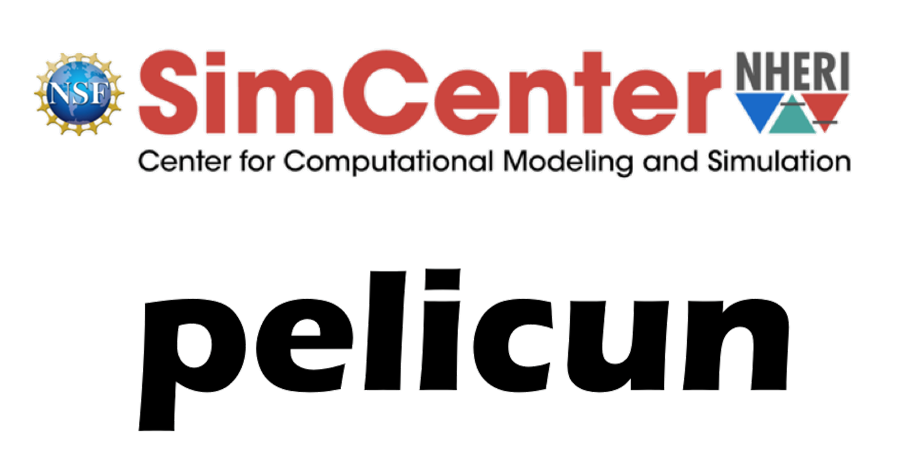

.. _cite:

Citing pelicun
--------------

When referencing pelicun in your research or publications, please use the following citation.
Proper citation is crucial for acknowledging the efforts of the development team and ensuring the reproducibility of your work.

.. card:: Latest pelicun citation
   :link: https://zenodo.org/doi/10.5281/zenodo.2558557

   .. latest-citation::

Logo
----

The pelicun logo is a trademark of NHERI-SimCenter and is protected under applicable trademark laws.
You are permitted to use the pelicun logo under the following conditions:

1. **Non-Commercial Use**: The logo may be used for non-commercial purposes, including academic publications, presentations, and educational materials, provided that such use is directly related to the pelicun software.

2. **Integrity of the Logo**: The logo must not be altered, modified, or distorted in any way.
   This includes changes to the logo's proportions, colors, and text, except for resizing that maintains the original aspect ratio.

3. **Attribution**: Any use of the logo must be accompanied by an attribution to "NHERI-SimCenter" as the owner of the pelicun logo.

4. **Prohibited Uses**: The logo must not be used in any manner that suggests endorsement or sponsorship by NHERI-SimCenter of any third-party products, services, or organizations, unless explicit permission has been granted.

5. **Legal Compliance**: The use of the pelicun logo must comply with all applicable laws and regulations, including those related to trademark and intellectual property rights.

For any uses not covered by the above terms, or to seek permission for commercial use, please contact NHERI-SimCenter directly.
